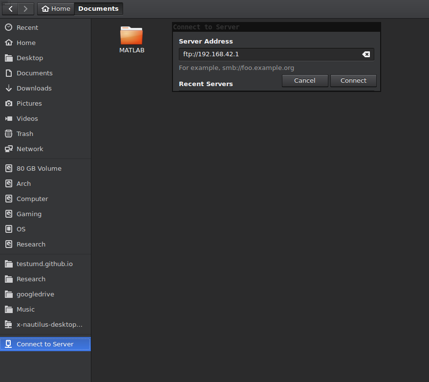

# Parrot-Bebop2-Setup 

## Changin the Firmware:
***
## Downgrading of Bebop 2 Firmware:
*Why Downgrade? Versions 4.1+ have issues with take-off. Bebop 2 experiences about 120-180 degree yaw on take-off.* If you have version 4.0.6, please skip the downgrade procedure. As of firmaware version 4.0.4, the downgrade procedure has changed.*

1. Connect your host machine to Bebop 2 via Wifi. 

2. Download the recommended version 4.0.6 firmware from [Google Drive](https://drive.google.com/open?id=1zrpRKtHe-TR_2FuedCzT5tQLqBkdp-Wy) or [Git Repo](https://github.com/prgumd/Parrot-Bebop2-Setup/blob/master/bebop2_update_v_4_0_6.plf).

Other versions of the firmware can be found here: <br />
[4.0.3](https://drive.google.com/open?id=1O4RBNLFKPhsZftSp4SUrgAJQNQsqYNCF), [4.0.4](https://drive.google.com/open?id=1X4IDXzgNrWdo4UWooByo7dMmTMmhng2E), [4.0.5](https://drive.google.com/open?id=1Na5ANPf5kCT_Nk1lxSXrvKhKcHNqo2_Y), [4.0.6](https://drive.google.com/open?id=1zrpRKtHe-TR_2FuedCzT5tQLqBkdp-Wy), [4.2.0](https://drive.google.com/open?id=1m72-I9pifd8PwQdeMOt1PEFuzDc4A6EH), [4.2.1](https://drive.google.com/open?id=1Hejt_EmKkXzUG-Ov9ZAeYIxU7XIGysvC), [4.3.1](https://drive.google.com/open?id=1wSwM9pdRsOSetmv1QOtJFEaOOWFMECtI), [4.4.0](https://drive.google.com/open?id=1e1uE-KZyVcUlgnGBhHri3eN6N4P2nZkd) <br />

Note that the firmwares are named as follows `bebop2_update_v_a_b_c.plf` for version `a.b.c`. For eg., for version 4.0.6 the name of the file is `bebop2_update_v_4_0_6.plf`.

3. Once the desired firmware is downloaded, a `telnet` client is required like (`Putty` or any FTP client like `FileZilla`). Alternatively on a linux machine, you can use a file manager like `nautilus` to copy the firmware to the Bebop. Now,
  * Turn on the Bebop and Connect to its WiFi network.
  * Press the power button 4 times in rapid succession on the Bebop 2. This activates the Telnet port.
  * Open a terminal and enter: `telnet 192.168.42.1`. 
You should see something like this:
```
BusyBox v1.25.0 (2017-06-29 09:25:56 CEST) built-in shell (ash)
Enter 'help' for a list of built-in commands.
/ #
```

4. Type the following in the same terminal window:
```
mount -o remount, rw / &&
vi /bin/updater/dgwl.txt
```

5. Now, you should see the contents of the file `dgwl.txt`:
```
# List of firmware versions to which to downgrade is allowed
# Regexps are basic regular expressions (BRE). See grep (1) manpage on a
# linux desktop to get the correct syntax (especially metacharacters escapes).
0 \ .0 \ .0
3 \ .3 \. [0-9] \ +
```
   * Press `i` to enter text entry mode in `vi`.
  
   * Type the version number of the firmware you downloaded in the last line:
  ```
  # List of firmware versions to which to downgrade is allowed 
  # Regexps are basic regular expressions (BRE). See grep (1) manpage on a 
  # linux desktop to get the correct syntax (especially metacharacters escapes). 
  0 \ .0 \ .0 
  3 \ .3 \. [0-9] \ + 
  4.0.6
  ```
  
   * Hit `ESC` key to exit the insert mode.
  
   * Save the file by typing 
  ```
  :wq
  ```
  
   * Hit `ENTER`
  
6. Start `nautilus` or any other `FTP` client and connect to the server with the address `192.168.42.1` anonymously (No `username` and `password`). See the image below.

7. Copy the downloaded firmware to `/data/ftp/internal_000` folder of the Bebop 2 and rename the file to `bebop2_update.plf`.
8. Go back to the telnet shell/terminal and enter:
```
/bin/updater/updater_scan.sh /data/ftp/internal_000
```
9. Bebop should return the following:
```
[FIRMWARE UPDATER] Boot # 4: Scanning / data / ftp / internal_000 for updates ...
[FIRMWARE UPDATER] Boot # 4: searching PLF named files * .plf ...
[FIRMWARE UPDATER] Boot # 4: Testing /data/ftp/internal_000/bebop2_update.plf
[FIRMWARE UPDATER] Boot # 4: Checking the downgrading whitelist /bin/updater/dgwl.txt ...
[FIRMWARE UPDATER] Boot # 4: whitelist: # List of firmware versions to which to downgrade is allowed
# Regexps are basic regular expressions (BRE). See grep (1) manpage on a
# linux desktop to get the correct syntax (especially metacharacters escapes).
0 \ .0 \ .0
3 \ .3 \. [0-9] \ +
4.0.6
[FIRMWARE UPDATER] Boot # 4: search result: 4.0.6
[FIRMWARE UPDATER] Boot # 4: downgrading allowed by whitelist
[FIRMWARE UPDATER] Boot # 4: Sending
/data/ftp/internal_000/bebop2_update.plf to the Update partition
[FIRMWARE UPDATER] Boot # 4: Move command is <mv>
```
  
10. And finally, reboot the Bebop 2 by entering `reboot` in the telnet terminal. 
*Note: Bebop will reboot multiple times for the firmware upgrade/downgrade procedure.* 
Check the version using `FreeFlight Pro` android/iOS app. It will ask you to update the firmware using the mobile application. **DO NOT UPGRADE THE FIRMWARE using your phone**.


Source: [THE DIARY OF ICARUS23](https://icarus23blog.wordpress.com/2017/07/14/downgrade-del-firmware-del-bebop-2/)


