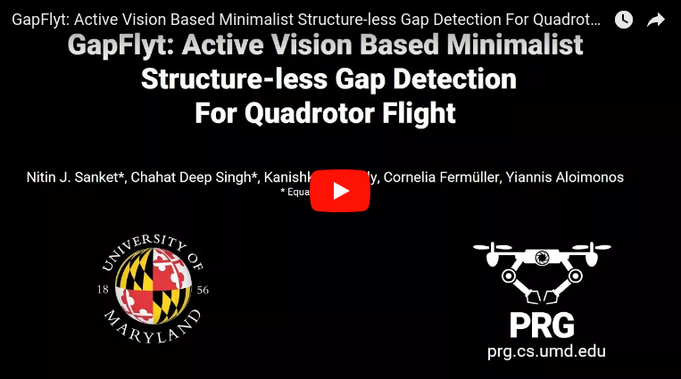

# GapFlyt: Active Vision Based Minimalist Structure-less Gap Detection For Quadrotor Flight

**GapFlyt** by [_Perception & Robotics Group_](http://prg.cs.umd.edu) at the Department of Computer Science, [University of Maryland- College Park](https://www.umd.edu/).

#### Check out the [Wiki](https://github.com/prgumd/GapFlyt/wiki) for the Hardware and Software setup.

#### Check out our Youtube video explaning the ....
[](https://www.youtube.com/watch?v=FSSqB7ag04w)


## Publication:
Nitin J Sanket*, Chahat Deep Singh*, Kanishka Ganguly, Cornelia Fermuller, Yiannis Aloimonos
```
@article{Sanket2018
blah 
blah

}
```

## License:
Copyright (C) etc.
